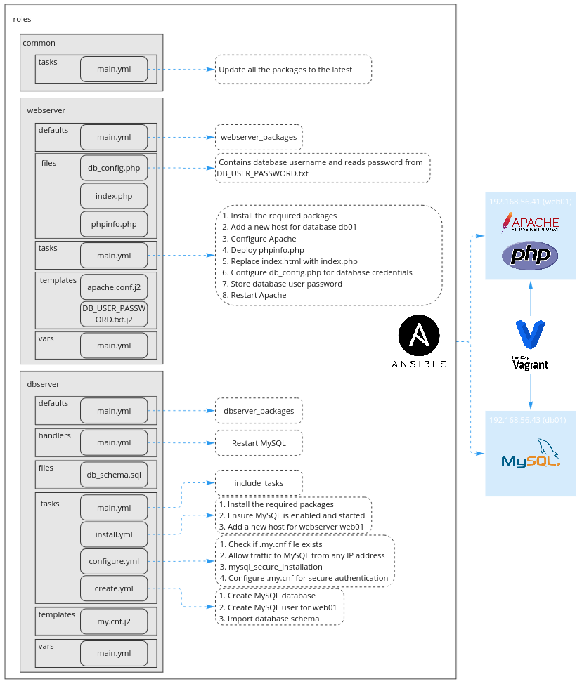
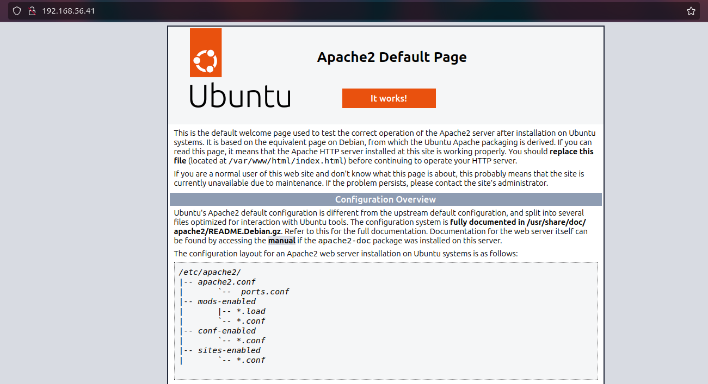
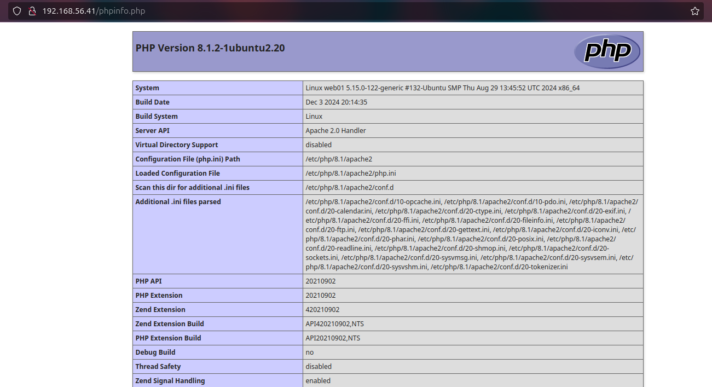
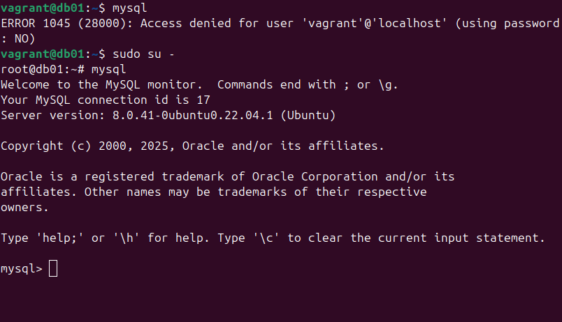
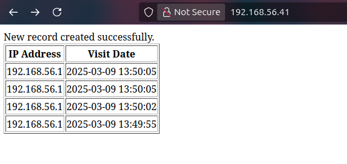

# Project: LAMP Stack Deployment using Ansible
## Overview
This project automates the provisioning of a LAMP (Linux, Apache, MySQL, PHP) stack using Ansible and Vagrant. It sets up a complete web server and database infrastructure, ensuring secure SSH access and seamless configuration management. The web server connects to the database to store and retrieve the IP address and visit date of each visitor accessing the index webpage.


### Features
- **Infrastructure as Code (IaC)**: Uses Vagrant to create virtual machines and Ansible for configuration.
- **Automated SSH Key Setup**: Generates and deploys SSH keys for secure Ansible connections.
- **Apache Web Server Deployment**: Installs and configures Apache with PHP support.
- **PHP Configuration**: Deploys a test PHP page to verify functionality.
- **MySQL Database Setup**: Installs MySQL, secures root access, and configures user permissions.

---

## Project Structure
```
|- LAMP_Stack_Deployment/  # Project root
|--- Inventory/            # Contains hosts file (inventory.ini) and configuration file (ansible.cfg)
|--- roles/                # Ansible Galaxy roles for organized and readable code
|----- common              # Applies general configurations across all servers
|----- webserver           # Installs and deploys the Apache and PHP
|----- dbserver            # Installs and configures MySQL, including authentication and user setup
|--- Screenshots/          # Stores the screenshots used to document this README.md file
|--- Secrets/              # Contains sensitive data (Will be ignored by Git)
|--- Vagrant/              # Contains the Vagrantfile for Ansible agents configuration
```

---

## Instructions
### Prerequisites
1. Ansible
2. Vagrant
3. Oracle VirtualBox

### Key-pair Creation
For Ansible's SSH connection, you will need a private key on the Ansible main machine and a public key on the targeted servers.
1. Run `ssh-keygen`, add the key path `/home/$USER/.ssh/ansible_course`, and hit enter for the rest to continue with default.
2. Move the keys to the `Secrets` directory.
3. Add provisioning to the [Vagrantfile](Vagrant/Vagrantfile) to create a new user `ansibleadmin`, and add the public key to the VM's `authorized_keys`. 
    ```
    # Configure VM as an Ansible agent
    # Create user "ansibleadmin" with sudo privileges and no password
    config.vm.provision "shell", inline: <<-SHELL
      echo "Provisioning VM..."
      sudo useradd -m -s /bin/bash "ansibleadmin"
      sudo usermod -aG sudo "ansibleadmin"
      echo "ansibleadmin ALL=(ALL) NOPASSWD:ALL" | sudo tee /etc/sudoers.d/ansibleadmin > /dev/null
      sudo chmod 440 "/etc/sudoers.d/ansibleadmin"
      echo "User 'ansibleadmin' has been created with sudo privileges and no password."
    SHELL

    # Copy the public key to /tmp on the VM instead of /home/ansibleadmin/.ssh/authorized_keys to avoid permission issues, as provisioning runs as the vagrant user
    config.vm.provision "file", source: "../Secrets/ansible_course.pub", destination: "/tmp/ansible_course.pub"

    # Move the key to the correct location with appropriate permissions
    config.vm.provision "shell", inline: <<-SHELL
      sudo su - ansibleadmin
      mkdir -p /home/ansibleadmin/.ssh
      mv /tmp/ansible_course.pub /home/ansibleadmin/.ssh/authorized_keys
      chmod 600 /home/ansibleadmin/.ssh/authorized_keys
      chown ansibleadmin:ansibleadmin /home/ansibleadmin/.ssh/authorized_keys
    SHELL
    ```

---

### Apache
1. Create a VM for the web server:
- `web01`: 600MB Memory (Minimum)

2. The web server should run Apache, and it needs to have the following packages:
- `apache2`
- `php`
- `libapache2-mod-php`: Ensures Apache can process PHP files properly.
- `php-mysql`: PHP extension for MySQL connectivity.

3. Apache needs to have the following configuration file stored in `/etc/apache2/sites-available/000-default.conf`
    ```
    <VirtualHost *:80>
        ServerAdmin webmaster@localhost
        DocumentRoot /var/www/html
     
        <Directory /var/www/html>
            AllowOverride All
        </Directory>
    </VirtualHost>
    ```

---

### PHP
1. Once you have the Apache web server running, we must ensure that PHP is running by deploying a simple PHP file. It should reside under the Apache's document root. For example, `/var/www/html/phpinfo.php` it should contain any PHP code. For example:
    ```php
    <?php
    phpinfo();
    ?>
    ```

2. Open the browser and navigate to `192.168.56.41` (or the IP address of the virtual machine where Apache is running); you should see the default Apache welcome page. Navigate to `/phpinfo.php` to verify that PHP is installed and configured.

<p align="center">
  <strong>Apache Welcome Page</strong>
  <br>
  
</p>

<p align="center">
  <strong>PHP Info Page</strong>
  <br>
  
</p>

3. Replace the `index.html` with our `index.php`.

---

### MySQL
1. Create a VM for the database server:
- `db01`: 1600MB Memory (Minimum)

2. For the Ansible playbook to perform the tasks that need connecting to MySQL, you must install the following packages first (including the MySQL server itself):
- `mysql-server`
- `python3-pymysql`
- `python3-mysql.connector`

3. Add new a host `web01` with the IP `192.168.56.41` in `/etc/hosts`.

4. Allow traffic to MySQL from any IP address.

5. Check if the `.my.cnf` file exists. This file contains the DB credentials and allows users to log in to the database without specifying the username and password.

6. If the file does not exist (first playbook run), execute the tasks of `mysql_secure_installation` command, and set the root password. After setting the root password, create the [.my.cnf](roles/dbserver/templates/my.cnf.j2) file as follows:
    ```
    [client]
    user=root
    password=root_password
    ```

7. Create the database `web_db`, the web user `web_user` for the web server `web01` to access the database, and Import the [database schema](roles/dbserver/files/db_schema.sql).

8. Try to log into MySQL using the root account to ensure that the `.my.cnf` file is working:
    ```sh
    sudo su -
    mysql
    ```

<p align="center">
  <strong>Root Password Configuration</strong>
  <br>
  
</p>

---

### Assignment Question
**Q. What is the difference between files in the role's files directory and those in the role's template directory?**
**A:** Files in the `templates/` directory are processed with Jinja2 templating before being copied to the target system using the `template` module, while files in the `files/` directory are transferred to the target system without modification using the `copy` module.

---

## Run Project
### Infrastructure Installation
After creating the key pair as mentioned earlier, navigate to the Vagrant directory and run the following command:
    ```sh
    vagrant up
    ```

### Playbook Execution
In project root directory, run the following command:
    ```sh
    ANSIBLE_CONFIG=Inventory/ansible.cfg ansible-playbook playbook.yaml --vault-password-file Secrets/ansible_vault_password.txt
    ```
    
### Outputs

<p align="center">
  <strong>Final Result</strong>
  <br>
  
</p>

---
