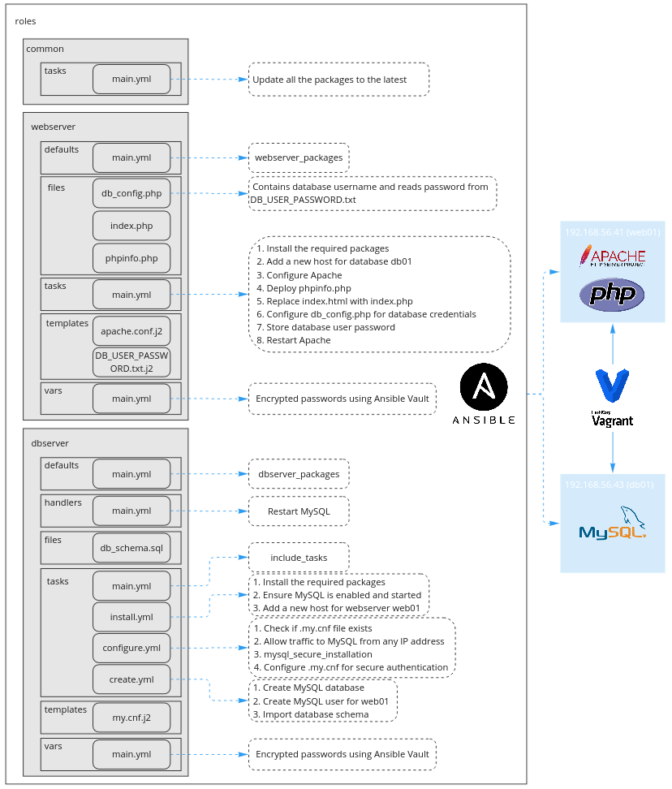

# LAMP Stack Deployment – Manual & Automated Approaches  

## Overview
This repository contains three different approaches to deploying a **LAMP (Linux, Apache, MySQL, PHP) stack**:
1. **Automated Deployment with Ansible & Vagrant** – Uses Infrastructure as Code (IaC) to provision and configure the stack automatically.
2. **Manual & Cloud-Based Deployment** – First sets up the stack manually on a local machine using Vagrant, then automates cloud deployment using Terraform, Hostinger, and AWS Route 53.
Each approach ensures the deployment of a **fully functional LAMP environment**, capable of hosting a **dynamic PHP-based web page that interacts with a MySQL database to store and retrieve the IP address and time of the page visitor**.

---

## Project Structure
```
LAMP_Stack_Deployment/
│── Fully_Automated_Using_Ansible/        # Automated deployment
│── Manually_And_Cloud_Hosted_With_DNS/   # Manual & Cloud
│── README.md                             # Main documentation
```

---

## Automated Deployment with Ansible & Vagrant
**Directory:** `Fully_Automated_Using_Ansible/`
This project **automates** the entire LAMP stack deployment using **Vagrant** to create virtual machines and **Ansible** for configuration management.
### Key Features
- **Infrastructure as Code (IaC)** – Automates provisioning & configuration.
- **Automated SSH Key Setup** – Secure connections between Ansible & VMs.
- **Apache Web Server** – Installs and configures Apache with PHP support.
- **MySQL Database** – Deploys MySQL with a secure setup and user permissions.
- **PHP-Based Web Page** – Interacts with MySQL to store & display visitor data.

*[Detailed Documentation Here](Fully_Automated_Using_Ansible/README.md)*



---

## Manual & Cloud-Based Deployment (Vagrant & Terraform)
**Directory:** `Manually_And_Cloud_Hosted_With_DNS/`
This project explores **two different methods** of setting up a LAMP stack:
1. **Manual Deployment with Vagrant** – Step-by-step setup of a LAMP server on a local virtual machine.
2. **Cloud Deployment with Terraform & Hostinger** – Uses **Terraform** to provision cloud instances on Hostinger and configure DNS with **AWS Route 53**.
### Key Features  
- **Manual LAMP Setup** – Step-by-step deployment of a LAMP stack, covering server configuration and software installation.
- **Publicly Accessible Web Server** – Registered the domain on **Hostinger** and configured DNS using **AWS Route53**.
- **Cloud Automation with Terraform** – Easily spin up a LAMP stack in the cloud.

*[Detailed Documentation Here](Manually_And_Cloud_Hosted_With_DNS/README.md)*


---
